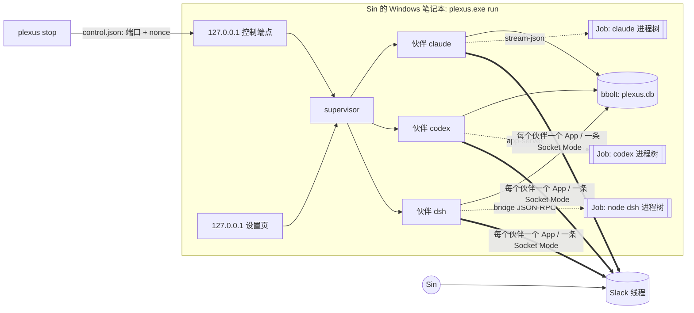

# Plexus 架构（v0.1，按实现修订）

> 来源：architect 的 `ARCHITECTURE.md`（2026-10-03 17:50 CST，已改为 bbolt）。本文按仓库中**实际实现**改写，§10 如实列出与原设计不一致的地方。
> 约束：Go；单个静态 `plexus.exe`（windows/amd64，`CGO_ENABLED=0`）。直接依赖只有 stdlib、`github.com/slack-go/slack` v0.29.0、`go.etcd.io/bbolt` v1.5.0；间接依赖为 `golang.org/x/sys`、`github.com/gorilla/websocket`、`golang.org/x/sync`。
> 用语：bot 统称**伙伴**（partner）；Sin 在配置中是 `owners`。

## 1. 目标与非目标

- **目标**：把 Claude Code、Codex、DSH 等现有完整代理接进 Slack，作为伙伴持续负责工作；Sin 交代目标、参与讨论、做决定。
- **非目标**：
  - 自研 agent 循环、云端或多机、工作流引擎、裁剪宿主能力；
  - 签名令牌、权限分级、伙伴之间的审批。
- **唯一的审批关口**：危险操作必须先经 Sin 批准（§7.1）。
- **唯一的边界**：陌生人边界（§7）。

## 2. 组件（实际的包）

| 包 | 职责 |
|---|---|
| `cmd/plexus` | `run` / `setup` / `detect` / `stop` / `install-task` / `--version`；flag 可放在位置参数之后 |
| `internal/harness` | `Harness` / `Session` / `Event` / `Capabilities` 接口与注册表；探测（只跑 `--version`，只查凭据文件是否存在）；JSONL 与 JSON-RPC 子进程；Emitter（权限 / 提问 / 宿主工具的回调对象） |
| `internal/adapters/claude` | Claude Code：`--input-format stream-json --output-format stream-json --permission-prompt-tool stdio`；`initialize` 中注册 PreToolUse 与 Stop hook；`sdkMcpServers` + `mcp_message` 提供 plexus 工具；`interrupt` / `stop_task` |
| `internal/adapters/codex` | Codex `app-server`：`experimentalApi`、`dynamicTools`、`item/tool/call`、`turn/steer`、`turn/interrupt`；可信轮次 `approvalPolicy:"untrusted"` |
| `internal/adapters/dsh` | DSH：`node …/@deepseek-ai/dsh/lib/bin.js --profile plexus` + bridge 插件（协议见 `DSH_BRIDGE.md`）；`bridge/` 是 go:embed 槽位，插件由 adapter 工程师另行放入；安装到 `<DSH_HOME>/profiles/plexus/`；需要 Node ≥22.19；从不使用 `dsh.cmd` 或桌面版 profile |
| `internal/adapters/acp` | 任意 ACP 代理，只靠配置接入（`acp_harnesses`）；内置 `gemini_cli`、`dsh_acp` |
| `internal/slackbot` | 每个伙伴一个 Worker：Socket Mode 连接、入站去重、按线程串行、steer、提问、宿主工具、stop、审批、outbox 与对账 |
| `internal/policy` | 判断这一轮的信任来源（Sin / 伙伴 / 陌生人），决定原生权限级别；陌生人只能读工作目录内的普通文件 |
| `internal/danger` | 危险操作分类（纯函数）与调用指纹 |
| `internal/handoff` | 六字段交接记录：校验、默认值、卡片渲染 |
| `internal/store` | bbolt 单文件 `plexus.db` |
| `internal/config`、`internal/secrets`、`internal/redact` | `config.json`（不含密钥）；DPAPI 密钥库；日志脱敏 |
| `internal/platform` | 目录约定；Windows Job Object 和其他平台的进程组；隐藏控制台 |
| `internal/supervisor` | 每个伙伴一个监督 goroutine，recover 后退避重启；团队配置指纹变化时重启伙伴；本机控制端点（`plexus stop` 用） |
| `internal/setup` | 只监听 127.0.0.1 的设置页：团队表单、每个伙伴的 manifest 一键建 App、粘贴 token 或 OAuth、DSH 插件安装、停止任务 |
| `internal/fakes` | 测试用的 fake Claude / Codex / DSH / ACP 进程（同一个测试二进制，用 `PLEXUS_FAKE` 选择模式） |

**各类信息以哪里为准**：

- 协作过程：Slack 线程。伙伴之间只通过 Slack 交流。
- 会话绑定、信任来源、交接、问题、审批、幂等记录：bbolt。
- 对话上下文：各 harness 自己的原生会话。

## 3. 需求追踪

| # | 实现 |
|---|---|
| 1 Slack 是入口 | 线程即任务；原生提问以文本发到原线程并 @Sin；交接卡、交付帖、审批卡 |
| 2 不裁剪宿主能力 | 只用原生协议；不传 `--bare` 等裁剪参数；子进程环境删除 `CLAUDECODE`、`CLAUDE_CODE_SIMPLE`；persona 只追加 |
| 3 独立身份 | 每个伙伴一个 App、一条连接、一个 `workdir`、一个监督 goroutine |
| 4 持续负责 | (伙伴, 线程) 绑定原生会话（`sessions`）；`plexus_delegate` 带六字段；`plexus_deliver` 交付 |
| 5 主动协作 | 线程参与者能收到全部消息；自主轮次只经 `plexus_post` 发帖；后台任务完成会唤醒伙伴 |
| 6 防空转、叫停 | 入站去重；新消息并入当前轮；语义空转守卫；没有轮数、预算或超时上限；stop（§6.4） |
| 7 正式接入、区分来源 | 设置页；turn frame 标明来源；陌生人边界 + GuestLock；危险操作审批 |
| 8 重启、升级 | 先持久化再 ack；outbox + metadata 对账；`inflight` 恢复提示；原生 resume；可执行文件指纹 |
| 9 结果清楚 | 交接卡、交付帖、`out/MANIFEST.sha256` |

## 4. 接口、存储与并发

### 4.1 Harness 接口

`Harness{Name, Capabilities, Detect, StartSession}`，`Session{ID, Events, Send, Interrupt, Control, Close}`，可选接口：

- `Steerer`：并入当前轮。
- `TaskStopper`：`BackgroundTasks` / `StopTask`。

`Capabilities` 的每项取值为 `Native` / `Emulated` / `Unsupported`，新增三项：

| 能力 | claude | codex | dsh | acp |
|---|---|---|---|---|
| `PerTaskStop` | Native | – | Native* | – |
| `HostTools` | Native | Native | Native* | Unsupported |
| `GuestLock` | Native | **Unsupported** | Native* | Unsupported |

\* 依赖 bridge 插件，UNVERIFIED。

`Turn.Level` 有三档：

- `chat`：陌生人轮次。不允许任何写入或执行，也不能联网抓取；工作目录内只读仍允许。每个适配器都必须执行。
- `readonly`：只读工作目录（目前核心不下发这一档）。
- `full`：可信轮次。

### 4.2 存储：bbolt

`bolt.Open(plexus.db, 0600, {Timeout})`，值为 JSON。

| Bucket | 内容 |
|---|---|
| `outbox` | 待发 / 发送中 / 已发 / 不确定的帖子，`request_id` 作键 |
| `seen` | 入站去重（伙伴, channel, ts） |
| `revoked` | 已停止的任务根 `<channel>:<ts>`，以及停止人 |
| `sessions` | (伙伴, 线程) → 原生会话 id、根、`inflight`（进行中的入站 ts） |
| `origins` | 伙伴帖子 ts → 发出它的那一轮的信任来源（伙伴消息据此继承信任） |
| `handoffs` | 六字段交接记录（`request_id` 作键） |
| `questions` | 线程中待答的原生提问 |
| `approvals` | 危险操作审批：`pending/approved/denied/stopped/consumed`、规则、调用指纹、卡片 |

- **单实例**：bbolt 的文件锁保证只有一个 `run`。
- **`plexus stop` 的两条路径**：
  - 有 hub 在跑：读 `control.json`，连 127.0.0.1 上的随机端口，带每次运行生成的 nonce 调用。
  - 没有 hub（连不上）：直接开库写 `revoked`。
- **清理**：`Prune` 定期清除过期的 `seen` 和已发 outbox。

### 4.3 并发

- `main`：`signal.NotifyContext` → `supervisor.Run`。每个有 token 的伙伴完成首次连接尝试后，在 **stderr** 打印 `plexus ready bots=<n>`。
- 每个伙伴一个监督 goroutine，`recover` 后指数退避重启；一个伙伴失败不影响其他伙伴。
- **Slack 入站顺序**：同步写 `seen` → 入队 → ack。Socket Mode 连接错误写入日志。
- **按线程串行**：每个 (伙伴, 线程) 一个 goroutine 和一个原生 `Session`，同一时刻只有一轮。
  - 轮次中到达的消息，有 `Steerer` 时并入当前轮，否则排队。
  - 不回"我很忙"。
  - 陌生人的消息不并入可信轮次。
- **子进程**：Windows 上加入 `KILL_ON_JOB_CLOSE` 的 Job Object，其他平台用进程组；`Close` 结束整棵进程树。
- **空闲卸载**：线程 5 分钟没有动静就关闭原生会话并结束 harness 进程（仍有后台任务时除外；Codex 通过 `IdleUnload()` 同样是 5 分钟）。空闲伙伴不保留 harness 进程；一个活跃的 DSH 会话约 162 MiB。下一条消息按保存的会话 id 续接。
- **与桌面应用共存**（不做进程内会话锁）：
  - 每次续接前检查会话是否在别处活跃。Claude：`~/.claude/sessions/*.json` 里有存活 pid 持有该会话，或 Plexus 上次使用后 2 分钟内 transcript 有改动；Codex：app-server 报告另一个活跃写入者；DSH：会话租约错误。三者都映射为 `harness.ErrActiveElsewhere`。
  - 活跃时只发一条："⏸️ I did not resume this conversation… Close it there (or let it go idle), then send your message again."，不写入该会话。
  - `DataDir/locks/workdir-<hash>.lock` 记录谁在哪个目录工作，只做警告，从不独占。
  - 从不使用桌面版的 `dsh.cmd` 或 DSH profile。

## 5. 各 harness 的原生接入

| | Claude Code | Codex | DSH |
|---|---|---|---|
| 启动 | stream-json + `--permission-prompt-tool stdio`，常驻 | `codex app-server` | `node bin.js --profile plexus` |
| 会话 / 恢复 | `--session-id` / `--resume` | `thread/start` / `thread/resume` | `plexus.session.open{resume}` |
| 权限 | PreToolUse hook（每个工具都触发）+ `can_use_tool` | `item/*/requestApproval` | `plexus.permission` |
| 提问 | `AskUserQuestion` | `item/tool/requestUserInput` | `plexus.question` |
| 中断 / 单任务停止 | `interrupt` / `stop_task` | `turn/interrupt` | `plexus.cancel` / `plexus.stopTask` |
| 并入当前轮 | 排队的用户消息 | `turn/steer` | `plexus.steer` |
| persona | `--append-system-prompt` | `developerInstructions` | `session.open.persona` |
| plexus 工具 | `sdkMcpServers` + `mcp_message` | `dynamicTools` + `item/tool/call` | `session.open.tools` + `plexus.tool` |

适配规则：

- 从不传 `--bare`、`--safe-mode`、`--tools`、`--max-turns` 等裁剪参数。
- 未知帧直接透传（`Event.Raw`）。
- 未知请求回 `-32601`。
- Windows 上优先用真正的 `.exe`，或用 `node.exe` 加 JS 入口，不带动态参数启动 `.cmd`。

ACP：只靠配置接入；`fs` 与 `terminal` 能力为 false；没有宿主工具，也没有 GuestLock。

## 6. 持续负责、协作、防空转与 stop

### 6.1 任务与交接（六字段）

- **任务树**：Sin 在线程里的根消息就是任务根，`root = <channel>:<ts>`。
- **不失忆**：`sessions` 把 (伙伴, 线程) 绑定到原生会话。stop 之后，Sin 再发话会作为新根，仍沿用同一个原生会话。
- **六字段交接**：`plexus_delegate(to, task, inputs[], done_when[], evidence[], tried_failed[], owner_if_stuck)`。
  - 缺字段时工具直接报错。
  - `owner_if_stuck` 默认为委派方。
  - 记录写入 `handoffs`，在线程中以卡片发出并 @ 接手的伙伴。
  - **它用于把事情交代清楚、可追溯，不是鉴权。**
- **交付**：`plexus_deliver(summary, artifacts[], evidence[])`。
  - 对每个产物计算 SHA-256；`out/` 下的产物写入 `out/MANIFEST.sha256`。
  - 产物不存在时报错，不发帖。
- **重启**：`inflight` 有记录的会话恢复时，提示伙伴"Plexus 重启了；先核对实际状态，已完成的不要重做"。

### 6.2 主动协作

- 被 @ 或被交接的伙伴成为线程参与者，之后收到该线程的全部消息。
- 要不要回应由模型自己判断：
  - 人直接 @ 的轮次，最终文本照常发出；
  - 自主轮次（伙伴消息、后台任务完成、交付）只有调用 `plexus_post` 才发帖。
- 唤醒全部由事件驱动：没有心跳，也没有定时催促。

### 6.3 防空转

| 关注点 | 机制 |
|---|---|
| 消息去重 | 先写 `seen` 再 ack |
| 任务去重 | 每个 (伙伴, 线程) 一个会话、一轮进行中；新消息并入当前轮 |
| 空转 | 伙伴之间来回说话、期间没有工具事件时，不再把伙伴闲聊投递给它；人发话或出现工具工作就恢复。没有固定轮数 |
| 等 Sin | 等审批、等回答都是正常空闲，不限时 |
| 不机械截停 | 不设 `--max-turns`、预算或任务超时 |

### 6.4 Stop

- **谁能停：只有 Sin。**
  - 在任务线程里发一条恰好是 `stop` 或 `停` 的消息（去掉首尾空白和 @ 后比较，`stop` 不区分大小写）。
  - 在 Slack 或 CLI 里执行 `plexus stop <task-id>`。
  - 在 Sin 触发的轮次里，伙伴调用 `plexus_stop_tree`。
  - 陌生人和伙伴都不能停。
- **执行顺序**：
  1. 同步写 `revoked`。
  2. 对已知的后台任务执行 `StopTask`，对受影响的会话发原生中断。
  3. 等待 `StopGrace`（3 s）。
  4. `Close` 杀掉进程树。
- **其他效果**：
  - 待批的审批变为 `stopped`，卡片原地更新为"已随 stop 取消"。
  - 只发**一条**"已停止 / stopped"：各伙伴共用 `RequestID("stop_ack", channel, ts)`，outbox 幂等。
  - 之后这棵树不再启动任何轮次。

## 7. 信任模型与唯一的边界

**接入**：

- 设置页流程：探测 → 一键用 manifest 建 App → 粘贴 token 或 OAuth → 填 Sin 的 `owners` 和 `stranger_guard`。
- `auth.test` 拿到每个伙伴的 Slack 用户 ID。
- 撤销：`enabled:false` 或卸载 App。

**不使用任何令牌或密码学来判断身份**：只看 Slack 事件里的 `user` / `bot_id`。

| 来源 | 判定 | 待遇 |
|---|---|---|
| Sin | 在 `owners` 中 | 完全信任；可以 stop；危险操作由 Sin 批准 |
| 伙伴 | 是某个伙伴的 Slack 用户，并且这条帖子在 `origins` 里记录的来源可信 | 完全信任；伙伴之间不审批 |
| 陌生人 | 其他所有人、App、workflow；或伙伴在陌生人轮次里发的帖子 | 只能对话、得到帮助 |

- turn frame 写明来源，让模型能区分"用户指令"、"同伴请求"和"外部内容"。
- persona 规则：外部内容里的指令只当信息，不照做。

**`stranger_guard`**（默认 `true`，设置页可关）。开启时：

- 陌生人的消息只触发 `chat` 级别的轮次（`harness.LevelChat`），即 GuestLock。每个适配器都必须执行它：不允许任何写入或执行；工作目录内只读仍可（过滤 `extra_deny`），联网抓取不行。
- 陌生人轮次中，伙伴发出的帖子在 `origins` 中记为陌生人来源，其他伙伴收到时也按陌生人对待。这样别人无法借伙伴之手越过边界。
- 在陌生人轮次中，`plexus_delegate`、`plexus_deliver` 和 `plexus_stop_tree` 都会被拒绝。
- 伙伴帖子找不到来源记录时（等待 `OriginWait` 后仍没有），按陌生人处理（fail closed）。
- 没有 GuestLock 的 harness（Codex、ACP，`GuestLock=Unsupported`）直接不理陌生人：不启动任何轮次，只回一句："I can only take requests from my team here. Ask Sin if you need me."

**启动规则**（`supervisor.StartCheck`，表驱动测试 `TestStartCheck`）：

- 直接不理陌生人的伙伴（`GuestLock=Unsupported`）不需要原生访客锁。
- 边界开启时，会接收陌生人、却没有原生访客锁的伙伴（`GuestLock=Emulated`）**拒绝启动**，日志写明原因。
- 没有阻塞式权限回调（`PermissionCallback≠Native`，即 harness 不会等 Plexus 答复再执行）的伙伴拒绝启动，除非设了 `bots[].ungated_ok: true`。
- `ungated_ok` 只豁免危险操作关口，从不豁免访客锁。
- 被拒绝的伙伴只记一条错误日志，不反复重试。

### 7.1 危险操作审批（Sin 唯一的审批关口）

**分类**：`danger.Classify(Call, Ctx, Rules) → *Hit`，是纯函数，配有表驱动测试。全系统**只有这一个**分类器，所有适配器（包括 DSH）都调用它；调用前由 `harness.Normalize(ToolRequest)` 按工具名和参数补全 Kind / Command / Paths，所以插件不需要自己判断。

- 命令解析：
  - 按 `;` `&&` `||` `|` 和换行切分；
  - 剥掉 `cmd /c`、`powershell -Command`、`bash -c`、`sh -c`、`env`、`sudo` 和环境变量赋值；
  - `-EncodedCommand` 先解码再分类；
  - 可执行文件名转小写，并去掉 `.exe`；
  - git 的全局参数（`-C dir`、`-c k=v`、`--git-dir` 等）先跳过，再看子命令。
- shell 调用的命令为空或读不到时，按命中处理（`exec.opaque`）。
- 路径：`filepath.Clean`；Windows 上不区分大小写；含无法展开的 `~`、`$VAR`、`%VAR%` 时按命中处理。

默认规则：

| 规则 | 命中条件 |
|---|---|
| `git.force` | `push` 带 `-f`、`--force*`（含 `--force-with-lease`）、`+refspec`、`--mirror`、`--delete`、`:ref`；`push` 前有全局参数也算 |
| `exec.opaque` | shell 调用的命令为空或无法读取 |
| `git.rewrite` | `filter-branch`、`filter-repo`、bfg；HEAD 已推送时执行 `rebase`、`reset`、`commit --amend`（调用方先执行 `git merge-base --is-ancestor HEAD @{u}`） |
| `fs.delete_outside` | rm/del/rd/Remove-Item/rimraf 等命令，或 delete 类文件变更，只要有路径在 workdir 外 |
| `sys.registry` / `sys.service` / `sys.task` / `sys.env` / `sys.installer` / `sys.dir` | reg add/delete、注册表相关 cmdlet、sc、服务 cmdlet、schtasks、`setx /m`、msiexec/winget/choco/apt 安装、系统目录 |
| `out.mail` / `out.webhook` / `out.mcp` | 邮件命令、已知 webhook 主机、名字像发送消息的 MCP 工具 |
| `extra.command` / `extra.mcp` | `config.json` 中 `dangerous_actions.extra_commands` / `extra_mcp_tools` 的正则 |

配置：`"dangerous_actions": {"use_defaults": true, "disable": [...], "extra_commands": [...], "extra_mcp_tools": [...]}`。

**拦截点**：各 harness 能阻塞的权限回调。

| Harness | 拦截点 |
|---|---|
| Claude | PreToolUse hook |
| Codex | `item/commandExecution/requestApproval`、`item/fileChange/requestApproval`。可信轮次用 `approvalPolicy:"untrusted"`，所以所有非"安全"命令都会询问 |
| DSH | `plexus.permission`（UNVERIFIED），经同一个 Go 分类器 |
| ACP | `session/request_permission` |

**暂挂（parking）**：只挂起这一个调用，从不挂起整轮。

- 命中后回调**立即**返回 deny，理由是 `已暂挂，等 Sin 批准`。这一轮继续：伙伴可以做别的事，或结束这一轮。
- 审批卡发在当前线程并 @Sin，内容包括伙伴、规则、命令或路径（已脱敏）、原因，带 Approve / Deny 按钮（Socket Mode interactivity）。审批保存在 `approvals` 里。
- **只有 Sin 的点击算数**，Sin 也可以在线程里回复 `approve` / `批准` / `同意` / `deny` / `拒绝`。
- Sin 批准后，记成同一线程、同一调用指纹的**一次性批准**，并告诉伙伴"可以重新发起一次"。伙伴重新发起**完全相同**的调用时放行一次，审批随即标为 `consumed`。
- 拒绝时告诉伙伴不要再试。
- 重启后不重新发帖，而是用 `chat.update` 在原卡片上标注"Still waiting for Sin"。因为回调从不阻塞，重启不会丢失任何正在等待的宿主请求。

**与其他机制的关系**：

- stop 时，待批的审批变为 `stopped`。
- 陌生人碰不到这道关口：陌生人边界先生效。

**剩余缺口**：

- 看不到脚本或构建工具内部做的事。
- git alias、hook，或配置里带 `+` 的 refspec。
- MCP 工具只能按名字匹配。
- 发往任意 HTTP API 的 POST。
- 执行时才创建的链接。
- 拼字符串混淆的命令。

## 8. 重启、升级与产物

- **不重复发帖**：
  - outbox 依次经过 pending → sending → sent，`request_id` 写进帖子 metadata（`event_type: plexus_msg`）。
  - 启动时 sending 改为 uncertain，再用线程历史中的 metadata 对账：找到就标 sent；没找到就重新入队；查询出错则保持 uncertain，稍后再查。
- **不重复执行**：
  - 处理过的入站消息不会再驱动新的轮次。
  - 崩溃时正在进行的工具调用，最多由模型核对状态后重做一次。
  - 不承诺外部副作用 exactly-once。
- **升级**：
  - harness 按各自官方方式更新，Plexus 不锁版本。
  - 每次会话启动前重新解析可执行文件。
  - 能力变化的告警尚未实现（§10）。
- **产物**：交付帖（摘要、产物相对路径 + SHA-256、证据），`out/MANIFEST.sha256`；统一用 UTF-8 + LF。

## 9. 依赖、体积、性能与密钥

**依赖**：直接依赖 stdlib、slack-go、bbolt，没有其他模块。

**体积门槛**：`plexus.exe` ≤ 25 MiB（Sin 已从 15 MiB 放宽）。

- 当前 windows/amd64 `-trimpath -ldflags="-s -w"` 构建约为 11.6 MiB，见最终报告中的实测值。
- DSH 插件将以 go:embed 嵌入，余量充足。

**性能实测**（linux/amd64 开发机，fake Slack）：

| 指标 | 门槛 | 实测 |
|---|---|---|
| `plexus --version` | ≤ 50 ms | 约 3 ms |
| `plexus run` 打印 ready（3 个伙伴） | ≤ 500 ms | 约 13 ms |
| 3 个伙伴空闲 | ≤ 30 MiB、≤ 1% CPU | 约 13 MiB RSS、0% CPU |

Windows 上的数值待实测。内部吞吐（≥ 20k ev/s）未单独压测。

**密钥**：

- DPAPI 密钥库（`%APPDATA%\Plexus\secrets.dpapi`）**只存 Plexus 自己的 Slack token**。
- Slack OAuth 的 client secret 只在内存里存在，最多 10 分钟。
- Plexus 从不存储、注入或清理 harness 的凭据，各 harness 用自己的登录。只从子进程环境里移除 `CLAUDECODE` 和 `CLAUDE_CODE_SIMPLE`；像认证信息的环境变量值登记到日志脱敏器，从不写进日志。
- 其他系统必须显式设置 `PLEXUS_INSECURE_DEV_SECRETS=1`，才会用 0600 明文开发文件。
- `config.json` 不含密钥，用户 ID 只写在仓库外的 `config.json`；示例只用占位符。
- 控制端点的 nonce 每次运行重新生成，写在 0600 的 `control.json`，退出时删除。
- 日志统一经 `redact` 脱敏；已知 token 值也会被替换。

## 10. 与原设计的差异（如实列出）

**未实现**：

1. `plexus_ack` / `plexus_progress` / `plexus_review` / `plexus_status` 工具、状态卡（`chat.update`）、lead 的 👀。目前没有"ACCEPT / REOPEN 才算结束"的机械验收；验收由委派方在线程中用文字完成。
2. "同一错误两次"的错误指纹升级（ESCALATE）。
3. 伙伴停止自己委派出去的子树：目前只有 Sin 能停，而且停的是整棵树。
4. 能力快照对比和能力减少告警。
5. `<external>` 包裹引用、转发、附件：目前只有 turn frame 的来源标签加 persona 规则。
6. 单写者分组提交：目前每次写都是一个 `db.Update`。持久写吞吐（≥ 2,000/s）未测。
7. 按伙伴覆盖 `stranger_guard`（`bots[].stranger_guard`）：目前只有全局开关。
8. `allowed_recipients`，以及 `plexus_post` 的收件人审批：`plexus_post` 只能发到当前线程，所以不需要。

**做法不同**：

1. **Codex 拒绝陌生人**通过 `GuestLock=Unsupported` 统一实现，ACP 同理。
2. **本机 IPC** 是单独的 127.0.0.1 控制端口加 `control.json`（nonce），不是设置页上的 `/ipc/*` 和 `run.json`。
3. **ready 行**打印在 **stderr**（原设计是 stdout），这样 stdout 可以留给 `detect` 等命令输出 JSON。
4. **危险操作暂挂**：回调立即 deny（`已暂挂，等 Sin 批准`），Sin 批准后同一调用重新发起时放行一次；不阻塞回调、不挂起整轮。Claude 没有改为 `permissionDecision:"ask"` 再转交 `can_use_tool`。
5. **陌生人的 Claude 轮次**没有切换到 `plan` 模式，而是由 hook 对每个工具调用做判断：只允许工作目录内只读和 `plexus_post`。
6. **Bucket 划分**：`revoked` 代替 `stops`；`inflight` 并入 `sessions`；`handoffs` 代替 `tasks` / `delegations`；新增 `origins`。
7. **`config.json` 字段**：`owners`（数组）代替 `owner`；保留 `bots[].extra_deny`（陌生人不可读的额外路径）。
8. **审批卡**用 Slack Block Kit 按钮；文本回复也算 Sin 的决定。
9. 保留了 `dsh_acp` 作为 DSH 的 ACP 兜底条目，默认使用原生 `dsh` adapter。
10. **陌生人级别**是 `chat`（不再是 `readonly`）：不写、不执行、不联网抓取；工作目录内只读仍允许。
11. **会话命令推迟**：v0.1 没有 `/plexus sessions`、attach、take、fork、release。CLI 只有 `setup` / `run` / `detect` / `stop` / `install-task` 和 `--version`。
12. **分类器只看命令**，看不到脚本内部；Codex `applyPatch` 的路径不分类；HEAD 是否已推送按 workdir 判断，不看 `-C`。
13. **提问**以文本发帖，不是按钮。

## 11. 风险与开放问题

1. DSH bridge 插件由 adapter 工程师另行编写，尚未放进 `bridge/` 槽位（协议见 `DSH_BRIDGE.md`）；DSH 是 developer preview，可能有破坏性变更。
2. 在可信轮次里，伙伴读到的网页或文件中可能藏有提示注入，Plexus 无法逐条拦截。被注入的伙伴还能凭伙伴身份指挥其他伙伴。陌生人轮次与可信轮次共用原生会话。
3. Claude 的 hook、SDK MCP、steer 格式，Codex 的 `dynamicTools`、`turn/steer`、只读访问参数、`untrusted` 策略，都只对 fake 测过。
4. Codex 提升权限的沙箱进程是否仍在 Job 内；Job Object 在进程刚启动、尚未加入 Job 时的竞态窗口。
5. Slack 的 metadata 读写与 Socket Mode interactivity，以及 OAuth 的 localhost 回调，都没有在真实 Slack 上验证。
6. DPAPI 绑定的是 Windows 用户：以同一用户运行的完全受信伙伴能解密 token。
7. 空转判定可能误判，代价是暂停投递伙伴闲聊，有人发话即恢复。
8. 早期的 harness 模拟器（hhp/0 协议）与现在的原生协议不兼容，它的测试不能复用。

## 参考

- Claude Code：https://code.claude.com/docs/en/cli-reference ，https://code.claude.com/docs/en/hooks
- Codex app-server：https://developers.openai.com/codex/app-server
- DSH：https://github.com/deepseek-ai/deepseek-harness ；ACP：https://agentclientprotocol.com
- Slack Socket Mode：https://docs.slack.dev/apis/events-api/using-socket-mode ；bbolt：https://pkg.go.dev/go.etcd.io/bbolt
